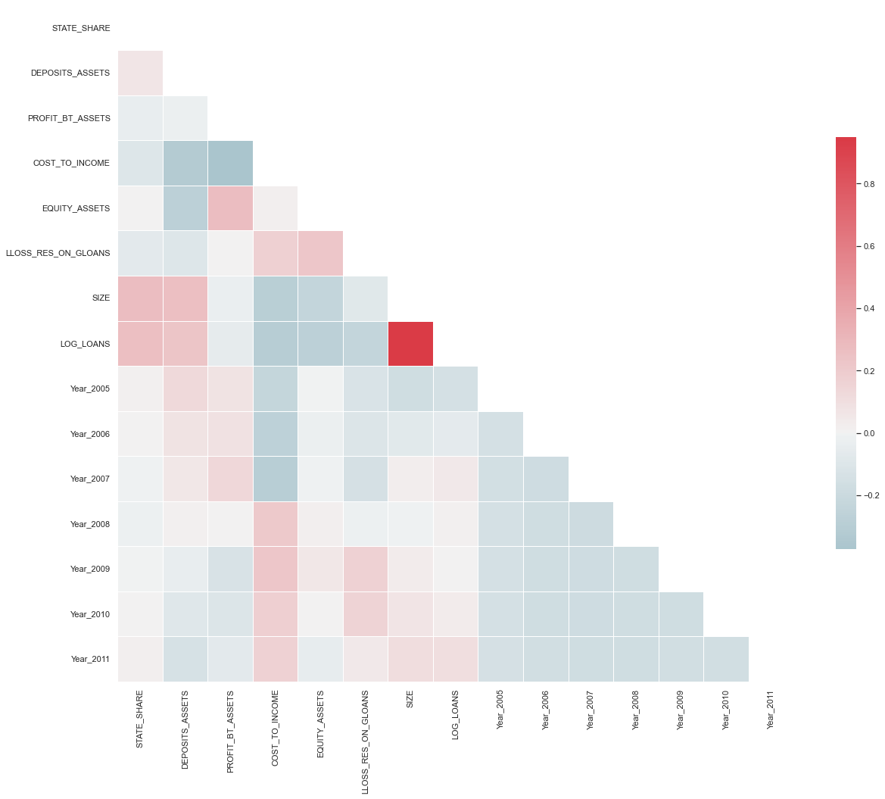
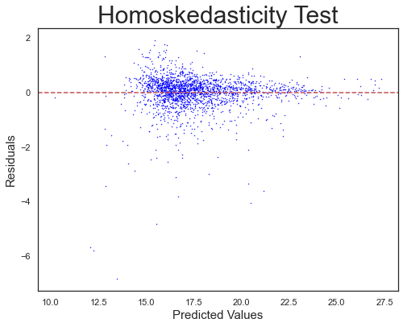

# financial_analysis_notebooks

The models etc. can be found in group_assignment.ipynb. Look for "_res" to quickly jump to the regressions etc.

Different model comparisons:

```
                                             Model Comparison                                            
=========================================================================================================
                                Pooled    Random Effects    Between OLS  Fixed Effects Random Effects New
---------------------------------------------------------------------------------------------------------
Dep. Variable                LOG_LOANS         LOG_LOANS      LOG_LOANS      LOG_LOANS          LOG_LOANS
Estimator                    PooledOLS     RandomEffects     BetweenOLS       PanelOLS      RandomEffects
No. Observations                  2033              2033            342           2033               2033
Cov. Est.                   Unadjusted        Unadjusted     Unadjusted     Unadjusted         Unadjusted
R-squared                       0.9274            0.8877         0.9345         0.8187             0.8877
R-Squared (Within)              0.8034            0.8175         0.7472         0.8187             0.8175
R-Squared (Between)             0.9328            0.9267         0.9345         0.9201             0.9267
R-Squared (Overall)             0.9274            0.9241         0.9226         0.9187             0.9241
F-statistic                     1984.6            1227.9         680.44         582.98             1227.9
P-value (F-stat)                0.0000            0.0000         0.0000         0.0000             0.0000
=====================     ============   ===============   ============   ============    ===============
const                           0.2251           -0.0320         1.1738         0.7116            -0.0320
                              (1.1318)         (-0.1237)       (2.1023)       (1.8114)          (-0.1237)
STATE_SHARE                    -0.0002            0.0006        -0.0003         0.0007             0.0006
                             (-0.2616)          (0.5844)      (-0.1639)       (0.5606)           (0.5844)
DEPOSITS_ASSETS                -0.4799           -0.2619        -0.6465        -0.2116            -0.2619
                             (-5.7584)         (-3.0623)      (-3.0382)      (-2.2732)          (-3.0623)
PROFIT_BT_ASSETS               -0.0575           -0.0251        -0.0941        -0.0198            -0.0251
                             (-5.8556)         (-3.4227)      (-3.1310)      (-2.6321)          (-3.4227)
COST_TO_INCOME                 -0.0054           -0.0018        -0.0106        -0.0014            -0.0018
                             (-5.5257)         (-2.4938)      (-3.5468)      (-1.8658)          (-2.4938)
EQUITY_ASSETS                  -0.2281            0.7134        -0.8220         0.8925             0.7134
                             (-1.3727)          (4.1646)      (-2.0738)       (4.5108)           (4.1646)
LLOSS_RES_ON_GLOANS            -0.0463           -0.0531        -0.0390        -0.0546            -0.0531
                             (-24.647)         (-31.815)      (-7.7640)      (-31.013)          (-31.815)
SIZE                            0.9971            0.9778         0.9832         0.9306             0.9778
                              (122.30)          (75.775)       (50.120)       (45.267)           (75.775)
Year.2006                       0.0075            0.0491                        0.0875             0.0491
                              (0.1389)          (1.4960)                      (2.5421)           (1.4960)
Year.2007                       0.0529            0.1154                        0.1843             0.1154
                              (0.9928)          (3.2667)                      (4.5598)           (3.2667)
Year.2008                       0.2457            0.2562                        0.3141             0.2562
                              (4.1735)          (6.4040)                      (7.0518)           (6.4040)
Year.2009                       0.1490            0.2027                        0.2737             0.2027
                              (2.4274)          (4.6794)                      (5.5812)           (4.6794)
Year.2010                       0.0917            0.1582                        0.2427             0.1582
                              (1.5026)          (3.5921)                      (4.7588)           (3.5921)
Year.2011                       0.1403            0.2005                        0.2931             0.2005
                              (2.2837)          (4.4546)                      (5.5395)           (4.4546)
======================= ============== ================= ============== ==============  =================
Effects                                                                         Entity                   
---------------------------------------------------------------------------------------------------------

T-stats reported in parentheses
```

# Multicollinearity heatmaps

With years



# Without years


# Testing for homoskedasticity graphically



Basically this is useful for seeing, if the PooledOLS model is suitable or if we should use Fixed Effects or Random Effects model instead. If the simple linear model violates the homoskedasticity, i.e., is heteroskedastic, we shouldn't use PooledOLS. Graphically this can be seen in the above *residuals-plot*, which represents predicted values (x-axis) vs. residuals (y-axis). If the plotted data points spread out, this is an indicator for growing **variance** and thus, for **heteroskedasticity**. Since this seems to be the case, we have an indication that PooledOLS probably isn't suitable.

We can check, if this is the case with the White and Breusch-Pagan-Test 